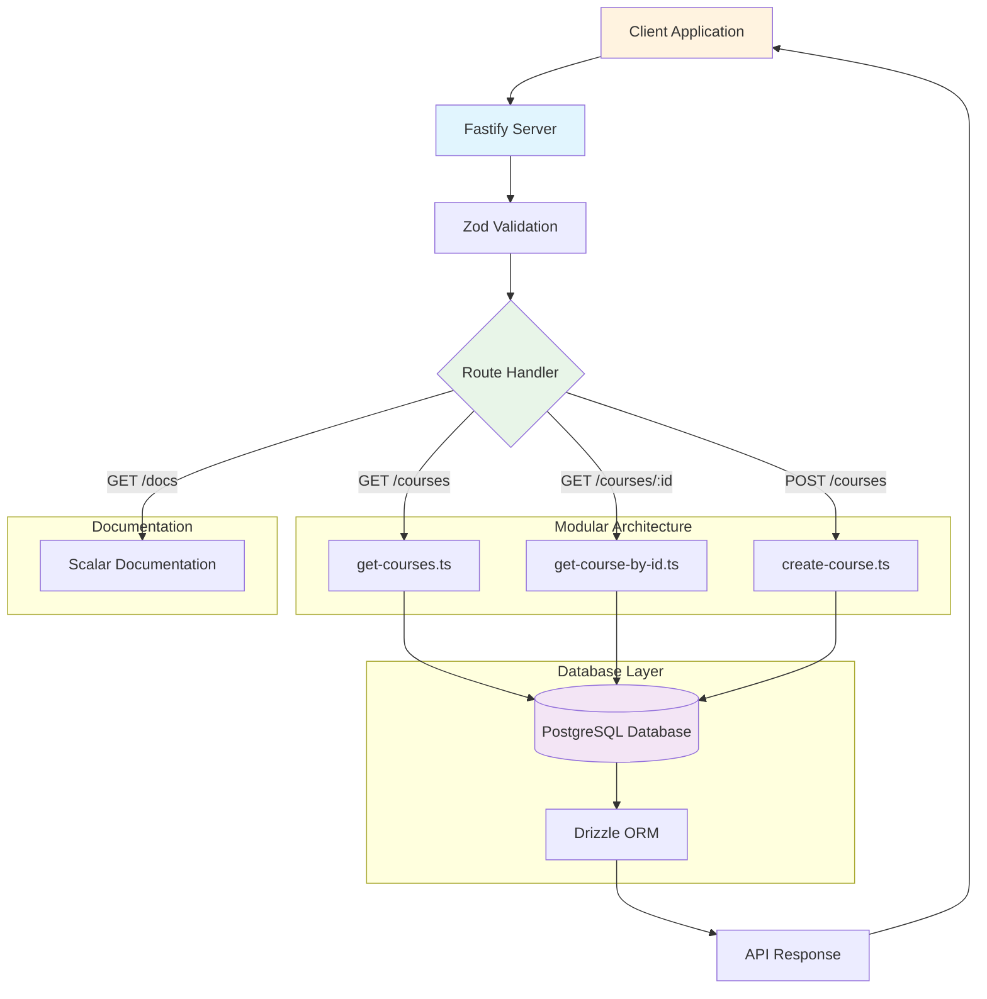

# Learn Gate API

A modern REST API built with Fastify and TypeScript for managing courses. This API provides comprehensive CRUD operations for course management with PostgreSQL database integration, featuring modular architecture, interactive API documentation, and robust validation.

## Features

- **Course Management**: Create, read, and manage courses with full CRUD operations
- **RESTful API**: Clean and intuitive endpoints with comprehensive validation
- **TypeScript**: Type-safe development with ES modules support
- **Fastify**: Fast and efficient web framework with plugin architecture
- **PostgreSQL Database**: Robust data persistence with PostgreSQL 17
- **Drizzle ORM**: Type-safe database operations and migrations
- **Interactive Documentation**: Beautiful API docs powered by Scalar
- **Modular Architecture**: Organized route structure for maintainability
- **Request Validation**: Zod schema validation for all endpoints
- **Docker Support**: Easy database setup with Docker Compose


### API Documentation
```
GET /docs
```
Interactive API documentation powered by Scalar with Kepler theme.

### Accessing the API Documentation

Once the server is running, you can access the interactive API documentation at:
- **API Docs**: `http://localhost:3333/docs`
- **API Endpoints**: `http://localhost:3333/courses`

## Development

The project uses TypeScript with experimental strip types for development, allowing you to run TypeScript files directly without compilation. The architecture follows Fastify's plugin system for modular route organization.

### Available Scripts

- `pnpm dev`: Start the development server with hot reload and file watching
- `pnpm db:migrate`: Run database migrations
- `pnpm db:generate`: Generate new database migrations
- `pnpm db:studio`: Open Drizzle Studio for database management

### Architecture

- **Modular Routes**: Each API endpoint is organized in separate files under `src/routes/`
- **Plugin System**: Routes are registered as Fastify plugins for better organization
- **Type Safety**: Full TypeScript support with Zod validation schemas
- **Auto Documentation**: OpenAPI specification auto-generated from route schemas

  
## Application Flow

The following diagram illustrates the key flow of the Learn Gate API, showing how requests are processed through the modular architecture:



### Flow Explanation

1. **Client Request**: External applications send HTTP requests to the Fastify server
2. **Validation**: Zod schemas validate request data and parameters
3. **Route Handling**: Modular route handlers process specific endpoints
4. **Database Operations**: Drizzle ORM interacts with PostgreSQL database
5. **Response**: Structured JSON responses are returned to the client
6. **Documentation**: Interactive API docs are served via Scalar

## Technology Stack

- **Runtime**: Node.js with ES modules
- **Framework**: Fastify 5.6.0
- **Language**: TypeScript 5.9.2
- **Database**: PostgreSQL 17
- **ORM**: Drizzle ORM 0.44.5
- **Validation**: Zod 4.1.11
- **Documentation**: Scalar API Reference 1.35.7
- **Package Manager**: pnpm

## Author

Mariano Capiliku

## License

ISC
